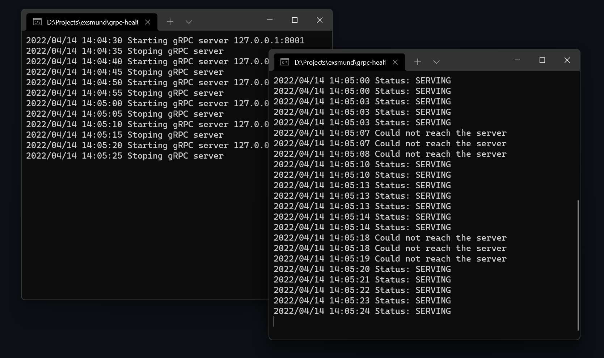

# gRPC health check example

The client uses one gprc.ClientConn with two services and is trying to check the health.

The server stops for every 5 second for 5 seconds.



## Run

The server
```
cd service/server
go run server/server.go
```

The client
```
cd service/client
go run server/client.go
```


## Rebuild protos
```bash
protoc --go_out=. --go_opt=paths=source_relative --go-grpc_out=. --go-grpc_opt=paths=source_relative protos/health/health.proto
```